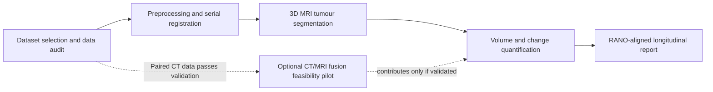

# Plan of Action: 12-Week Research Roadmap

## Longitudinal AI-Driven Brain Tumour Analysis Using MRI and CT

**Purpose:** Presentation-ready execution plan starting from project initiation, not a retrospective list of completed versus pending tasks.  
**Duration:** **12 weeks (approximately three months)**, with an 8-week core prototype and 4 weeks for validation, documentation, and contingency.  
**Primary deliverable:** A reproducible **longitudinal MRI tumour-segmentation and volumetric tracking prototype** that quantifies tumour evolution across serial scans and generates a RANO-aligned research report.

> **Scope decision for feasibility:** A fully trained CT+MRI fusion model is **not guaranteed within 12 weeks** because the current BraTS workspace is MRI-only and contains no verified paired CT+MRI cohort. The MRI longitudinal prototype is therefore the required deliverable. CT is an **explicit gated extension**: it proceeds only if a paired dataset, label provenance, and registration metadata pass the data-contract review by the end of Week 3. This is consistent with the repository plan’s CT/MRI gate and protects the project from unsupported claims. [Project plan](plan/process-brats-classification-next-steps-1.md)

---

## 1. Project Objective and Research Questions

The project will develop a computational workflow that aligns serial brain MRI studies, segments tumour sub-regions, measures interval volume changes, and summarizes longitudinal treatment response. The workflow will use MRI as the mandatory modality and will only add CT when genuine subject-level pairs are available and technically compatible.

| Research question | Operational answer within 12 weeks | Evidence produced |
|---|---|---|
| Can tumour sub-regions be segmented automatically on routine MRI? | Train or adapt a lightweight 3D segmentation baseline using verified masks and case-level splits. | Dice score, HD95, qualitative overlays, segmentation checkpoint. |
| Can tumour change be quantified consistently across timepoints? | Register sequential scans and calculate ET, TC, and WT volumes and percentage changes. | Longitudinal volume table, response plots, tracking report. |
| Can the workflow support response monitoring? | Map volumetric changes to RANO-aligned research categories; maintain a clinician-review flag rather than claim autonomous diagnosis. | Per-patient longitudinal summary and decision-support prototype. |
| Can CT improve the system? | Assess data availability and create a verified CT/MRI data contract. Fusion is attempted only if the gate passes. | Dataset audit and a go/no-go decision; optional fusion pilot. |

---

## 2. High-Level Workflow

---

## 3. Twelve-Week Timeline

| Week | Phase and objective | Planned activities | Tangible output / decision gate |
|---|---|---|---|
| **1** | **Define the study and freeze scope** | Finalize the primary endpoint: longitudinal MRI tumour-volume tracking. Define tumour sub-regions (ET, TC, WT), success metrics, inclusion/exclusion criteria, and a data dictionary. Set a subject-level split policy and reproducibility folder structure. | One-page protocol, research questions, endpoint definitions, risk register, and frozen implementation scope. |
| **2** | **Acquire and audit data** | Verify availability of raw MRI images, segmentation masks, serial timepoints, and clinical/response labels. Check image integrity, anonymization, patient IDs, modalities, voxel spacing, missingness, and duplicate acquisitions. | Data-inventory report and subject-level manifest. **No model training begins until this passes.** |
| **3** | **Resolve the CT decision gate** | Identify a genuinely paired CT+MRI source, if available; verify patient matching, scan orientation, spacing, registration information, and label provenance. In parallel, confirm whether MRI data contain enough serial scans for tracking. | **Go/no-go decision:** continue with MRI longitudinal core; allow CT pilot only if all pairing checks pass. If the gate fails, document CT as future work rather than fabricate fusion results. |
| **4** | **Build preprocessing and registration pipeline** | Implement skull stripping/brain masking, intensity normalization, resampling, and within-patient rigid plus deformable registration to baseline. Perform visual quality control on a representative sample. | Versioned preprocessing script, registration quality-control images, and aligned longitudinal MRI tensors. |
| **5** | **Establish segmentation baseline** | Prepare MRI and mask loaders with case-level train/validation/test separation. Train or adapt an efficient 3D segmentation model (for example, nnU-Net-compatible baseline or a compact 3D U-Net) under the available VRAM/RAM budget. | Baseline checkpoint, training log, and first ET/TC/WT segmentation results. |
| **6** | **Validate segmentation and refine once** | Compute Dice, HD95, and per-region error summaries. Review failure cases such as small lesions, post-operative cavities, edema boundaries, and missing sequences. Conduct at most one planned refinement cycle to avoid uncontrolled tuning. | Segmentation evaluation table, visual error analysis, and frozen model-selection decision. |
| **7** | **Implement longitudinal tracking** | Link scans from the same patient across timepoints. Compute ET, TC, and WT volumes; absolute and percentage volume change; lesion count where applicable; and change trajectories. | Patient-level longitudinal feature table and volume-change plots. |
| **8** | **Create RANO-aligned reporting layer** | Convert measurements into RANO-aligned research indicators: reduction, stability, increase, and review-required status. Add uncertainty and clinician-review flags; do not claim independent diagnosis of pseudoprogression without ground-truth labels. | Automated longitudinal report template for representative patients. |
| **9** | **Run end-to-end validation** | Test the complete pipeline on a held-out subject set. Measure segmentation, tracking stability, processing time, and failure rates. Compare automated volumetric measurements with available manual labels or expert reference annotations. | End-to-end evaluation report, processing-time summary, and limitations table. |
| **10** | **Optional CT/MRI feasibility pilot** | **Only if the Week 3 gate passed:** run a small, separate fusion feasibility experiment using the audited paired cohort. Compare MRI-only versus CT+MRI on the same split; keep outputs separate from the MRI results. **If CT gate failed:** use this week for robustness testing across MRI sequences and missing-modality simulation. | Either a clearly labelled CT/MRI pilot result or additional MRI robustness evidence. |
| **11** | **Prepare reproducible demonstration** | Package the inference workflow, sample inputs, model card, commands, visual overlays, and longitudinal dashboard/report. Re-run essential tests in a clean environment. | Demonstrable prototype and reproducibility checklist. |
| **12** | **Write, review, and present findings** | Finalize the report, results tables, methodology, limitations, ethics/data statement, and future-work plan. Prepare a short presentation with the workflow, metrics, representative patient trajectories, CT decision, and honest limitations. | Final report, presentation deck, code handover, and next-phase recommendation. |

---

## 4. Deliverables by Month

| Time point | Required deliverables | Success condition |
|---|---|---|
| **End of Month 1 (Weeks 1–4)** | Protocol, audited dataset manifest, CT go/no-go record, preprocessing and registration pipeline. | Serial MRI data and masks are confirmed; every scan is traceable to one subject and one timepoint. |
| **End of Month 2 (Weeks 5–8)** | Segmentation baseline, quantitative validation, longitudinal volume tracker, RANO-aligned report template. | The MRI-only workflow produces stable sub-region masks and time-series measurements on held-out cases. |
| **End of Month 3 (Weeks 9–12)** | End-to-end evaluation, optional CT pilot or MRI robustness study, reproducible demo, final documentation, presentation. | Results are reproducible, limitations are explicit, and the prototype can be demonstrated from scan input to longitudinal report. |

---

## 5. Scope Boundaries That Keep the Plan Doable

The plan deliberately separates **what must be delivered** from **what is exploratory**. This avoids promising a clinically deployable CT+MRI system when the current repository itself states that BraTS is MRI-only and that CT/MRI fusion requires separately verified pairs. [README](README.md) [Project plan](plan/process-brats-classification-next-steps-1.md)

| Required within 12 weeks | Conditional / future work |
|---|---|
| MRI preprocessing, serial registration, 3D segmentation, volumetric tracking, response report, held-out validation, documentation. | CT+MRI fusion training, MRI-to-CT synthesis, survival prediction, federated learning, or pseudoprogression diagnosis without verified labels. |
| Use existing MRI classifier work only as a baseline/reference artifact; do not treat the ET-derived grade-proxy classifier as clinical-grade evidence. | Any claim that the prototype autonomously determines clinical progression or replaces radiologist assessment. |
| One lightweight segmentation architecture and one planned refinement cycle. | Multiple architectures, unlimited hyperparameter search, or test-set tuning. |

---

## 6. Core Risks and Practical Mitigations

| Risk | Impact | Mitigation embedded in the plan |
|---|---|---|
| No reliable paired CT+MRI dataset | CT fusion cannot be validated honestly. | Week 3 gate makes CT optional; MRI longitudinal tracking remains a complete, defensible project. |
| Raw segmentation masks or serial scans are unavailable | Segmentation/tracking cannot be trained or evaluated. | Week 2 audit identifies the blocker before model work; use an openly documented longitudinal MRI cohort or shift to a segmentation inference-and-tracking prototype. |
| Limited GPU/RAM | Large 3D models may crash or delay progress. | Use compact patch-based 3D models, mixed precision, single-process training, and a predefined memory budget. |
| Few labels for true progression or pseudoprogression | No credible supervised progression classifier can be trained. | Restrict output to RANO-aligned volumetric decision support with clinician-review flags; state this limitation explicitly. |
| Dataset/domain shift | Benchmark metrics may not transfer to real clinical workflows. | Hold out subjects, document preprocessing, run robustness checks, and avoid clinical deployment claims. |

---

## 7. Presentation Talking Points

> **Our 12-week plan is intentionally data-first.** We validate the availability and integrity of longitudinal imaging before committing to model development.

> **The required outcome is a working MRI longitudinal prototype.** CT fusion is a gated research extension, not an unsupported promise.

> **The innovation is temporal measurement, not only tumour detection.** The system aligns serial scans, segments tumour sub-regions, and reports objective change trajectories for clinical review.

> **The timeline protects scientific validity.** It includes subject-disjoint evaluation, one controlled refinement cycle, explicit uncertainty, and reproducibility checks rather than unbounded model tuning.

---

## 8. Immediate Actions After Approval

The first three actions are to freeze the protocol and primary endpoint, audit raw data and timepoint availability, and issue the Week 3 CT/MRI go/no-go memo. Only then should preprocessing, segmentation, and longitudinal tracking implementation begin.

## Internal Project References

1. [Current executable MRI plan and CT/MRI gate](plan/process-brats-classification-next-steps-1.md)
2. [Project handover and validated MRI baseline](HANDOVER.md)
3. [Current repository scope and limitations](README.md)
4. [Implementation specification](IMPLEMENTATION_SPEC.md)

---

**Recommended presentation title:** *A Feasible 12-Week Roadmap for Longitudinal AI-Driven Brain Tumour Monitoring*
