# BraTS 2024 MRI-Only Glioma Grade-Proxy Classification

## Research presentation report, methods, results, visual evidence, and limitations

**Prepared:** 2026-08-14  
**Project:** `major101`  
**Study scope:** BraTS 2024 preprocessed four-channel MRI only  
**Model status:** Repaired research prototype; not a clinical diagnostic system  
**Primary checkpoint:** `outputs/training/repaired_final/best_checkpoint.pth`  
**Locked-test evaluation:** `outputs/evaluation/repaired_final/summary.json`

> **Panel verdict in one sentence:** The repaired pipeline is data-audited, subject-disjoint, reproducible, and memory-safe, and it learns a measurable ranking signal on the unseen partition; however, the current thresholded test performance is modest and the target is an ET-derived `grade_proxy`, not an independent WHO-grade annotation, so this is credible research evidence rather than clinical-grade validation.

> **Current validation addendum — 2026-08-14:** Five complete subject-disjoint folds now cover all 788 development cases. Mean best fold AUROC is `0.7987`, pooled out-of-fold AUROC is `0.7641` with bootstrap 95% CI `0.7261–0.8018`, and the final calibrated locked-test AUROC is `0.7672`. The final locked-test balanced accuracy is `0.5261` at the development-only threshold `0.53`; this remains a weak thresholded classifier and does not establish clinical grading.

---

## 1. Executive summary

This project investigates whether a compact three-dimensional convolutional neural network can classify a BraTS MRI case into two binary proxy groups under strict hardware limits:

- **LOW proxy:** `grade_proxy = 0`
- **HIGH proxy:** `grade_proxy = 1`

The current experiment uses the four preprocessed MRI channels available in the checkout:

1. T1ce — contrast-enhanced T1-weighted MRI
2. T1n — native/non-enhanced T1-weighted MRI
3. T2f — T2-FLAIR MRI
4. T2w — T2-weighted MRI

The implementation was repaired around five research risks:

1. repeated rows in the labels file could duplicate cases;
2. repeated acquisitions could cross the train/validation/test boundary;
3. full-volume loading was unsafe for the stated RAM/VRAM limits;
4. background-heavy random crops could hide useful image evidence;
5. accuracy alone could reward majority-class prediction while hiding class collapse.

The resulting pipeline:

- validates every preprocessed volume before training;
- reduces 994 label rows to 876 unique labelled cases;
- rejects conflicting duplicate labels;
- keeps repeated acquisitions from the same subject in one split;
- loads `.npy` volumes using memory mapping and copies only one 96³ crop at a time;
- uses a small GroupNorm-based 3D CNN with 501,289 parameters;
- uses balanced binary batches, mixed precision, gradient accumulation, and explicit memory guards;
- selects the decision threshold on validation data only;
- evaluates the 88-case test partition once under a locked, predeclared protocol;
- produces modality slices, Grad-CAM overlays, input-gradient saliency, per-case evidence JSON, and manifests.

### Main measured results

| Evaluation partition | Cases | Accuracy | Balanced accuracy | AUROC | Average precision | F1 | Sensitivity | Specificity |
|---|---:|---:|---:|---:|---:|---:|---:|---:|
| Five-fold development mean of best checkpoints | 788 across 5 folds | — | **0.7592** | **0.7987** | 0.9385 | 0.7828 | 0.6800 | 0.8384 |
| Pooled development out-of-fold, threshold 0.52 | 788 | 0.6739 | **0.7288** | 0.7641 | 0.9267 | 0.7587 | 0.6382 | 0.8194 |
| Final locked unseen test, calibrated threshold 0.53 | 88 | **0.7045** | 0.5261 | **0.7672** | **0.9431** | **0.8169** | **0.8169** | 0.2353 |
| Majority HIGH baseline on locked test | 88 | **0.8068** | 0.5000 | 0.5000 | 0.8068 | 0.8921 | 1.0000 | 0.0000 |

The model does **not** beat the majority baseline on raw accuracy. It does exceed random ranking (`AUROC = 0.5`) and majority balanced accuracy (`0.5`) on the locked test. This means the model contains useful ordering information, but its current operating threshold does not produce a strong balanced classifier on the unseen partition.

That distinction is central to the research interpretation:

- **Ranking signal:** present.
- **Thresholded classification quality:** moderate to weak.
- **Clinical grade prediction:** not demonstrated.

---

## 2. What was actually studied

### 2.1 Study question

> Can a memory-bounded 3D MRI classifier learn a reproducible image-only signal associated with the dataset's binary `grade_proxy` label while avoiding data leakage and class-collapse artifacts?

This is narrower than the original project vision. It does not claim to solve:

- independent WHO glioma grading;
- clinical diagnosis;
- treatment response prediction;
- survival prediction;
- longitudinal progression monitoring;
- CT/MRI fusion;
- segmentation performance.

BraTS documentation describes the MRI sequences used in the ecosystem, and the BraTS 2024 challenge is an MRI-based benchmark. Earlier foundational BraTS publications also define the benchmark around multimodal MR rather than a paired CT input; see [Menze et al., 2015](https://doi.org/10.1109/TMI.2014.2377694) and [Bakas et al., 2017](https://doi.org/10.1038/sdata.2017.117). The current checkout contains no paired CT channel in the verified training input. CT is therefore outside this report by design. See the [BraTS documentation](https://brats.readthedocs.io/en/stable/) and the [BraTS 2024 challenge paper](https://arxiv.org/abs/2405.18368).

### 2.2 Label interpretation and the most important caveat

The target column is called `grade_proxy`. In this project it is derived from enhancing-tumour presence, rather than independently supplied pathology or WHO-grade labels. Therefore:

> A model can learn a relationship between MRI appearance and the ET-derived proxy without learning clinically valid glioma grade.

This is why the report uses **LOW proxy** and **HIGH proxy** language where possible. Terms such as LGG and GBM may appear in historical repository notes, but they should not be interpreted as independently verified clinical labels in this experiment.

The ET-volume feature model is excluded from all valid model claims because a feature derived from enhancing-tumour presence can reproduce the rule used to construct the target. Its near-perfect historical score is an artifact of label construction, not evidence of clinical performance.

---

## 3. Data-quality audit

The complete data audit is stored in [`outputs/data_quality/preprocessed_data_report.json`](../outputs/data_quality/preprocessed_data_report.json).

### 3.1 File-level contract

| Check | Required | Observed | Result |
|---|---:|---:|---|
| Preprocessed `.npy` files inspected | 882 | 882 | PASS |
| Expected tensor shape | `(4, 182, 218, 182)` | all valid files | PASS |
| Expected dtype | `float32` | all valid files | PASS |
| Non-finite volumes | 0 | 0 | PASS |
| Invalid files | 0 | 0 | PASS |
| Labelled cases with missing `.npy` file | 0 | 0 | PASS |
| Conflicting duplicate labels | 0 | 0 | PASS |
| Complete scan | yes | yes | PASS |

The four-channel volume contains approximately 28.8 million values per case before cropping. At four bytes per `float32` value, a raw case is roughly 115 MB. Copying the full dataset or several full cases into application memory would be a poor fit for a 3 GB system-RAM limit. The repaired loader instead memory-maps the file and copies only the sampled crop for normal training.

### 3.2 Label-table audit

| Label-table property | Observed |
|---|---:|
| Raw CSV rows | 994 |
| Duplicate rows | 236 |
| Unique labelled cases after deduplication | 876 |
| LOW-proxy cases | 172 |
| HIGH-proxy cases | 704 |
| Conflicting duplicate-label cases | 0 |
| Unlabelled orphan volumes | 6 |

The six orphan volumes were identified by the audit but not used as labelled training examples. A file being present in the preprocessed directory is not enough to make it a valid supervised example; the loader requires an unambiguous label row.

### 3.3 Split protocol

The main repaired run uses seed `42` and a subject-disjoint split:

| Partition | Cases | Subjects | LOW | HIGH | Role |
|---|---:|---:|---:|---:|---|
| Train | 700 | 300 | 137 | 563 | Parameter fitting |
| Validation | 88 | 37 | 18 | 70 | Checkpoint and threshold selection |
| Locked test | 88 | 41 | 17 | 71 | Final unseen evaluation |

Repeated acquisitions such as `BraTS-GLI-xxxxx-100` and `BraTS-GLI-xxxxx-101` are grouped by their subject prefix. A subject cannot contribute one acquisition to training and another acquisition to validation or test.

This is more conservative than a naïve row-level split. Without grouping, the model could receive nearly identical acquisitions from one subject in both fitting and evaluation, producing an inflated score. MRI-specific leakage research has shown that subject-wise separation is important because record-wise image splits can overestimate diagnostic performance; see [Yagis et al., 2021](https://doi.org/10.1038/s41598-021-01681-w).

The grouped-stratified principle is consistent with the official scikit-learn description of [`StratifiedGroupKFold`](https://scikit-learn.org/stable/modules/generated/sklearn.model_selection.StratifiedGroupKFold.html): preserve class proportions as far as possible while keeping groups non-overlapping.

---

## 4. Repair work that changed the reliability of the experiment

| Earlier risk | Root cause | Repair | Evidence |
|---|---|---|---|
| Duplicate-case leakage | 994 CSV rows represented only 876 unique cases | Deduplicate by case and reject conflicting labels | 5/5 contract tests pass; audit reports zero conflicts |
| Subject leakage | Repeated acquisitions were treated as independent rows | Group by subject prefix during splitting | Train/validation/test subject sets are disjoint |
| Excess memory use | Full volumes were materialised before training | `np.load(..., mmap_mode="r")`, crop-first loading, `num_workers=0` | Peak smoke VRAM 1.02 GiB; peak process RAM 0.43 GiB |
| Background-heavy crops | Old heuristic counted nonzero T1n values even though background is near `-1` | Candidate scoring prioritises T1ce bright-voxel coverage and valid-brain coverage | Fixed deterministic evaluation crops and informative training candidates |
| Focal-loss instability | The earlier loss path could broadcast class weights across a batch | Per-sample loss weighting and explicit regression test | `test_binary_loss_applies_weights_per_sample` passes |
| Class-collapse masking | Accuracy could look acceptable when predicting the majority class | Report balanced accuracy, F1, sensitivity, specificity, AUROC, AP, confusion matrix, and predicted-positive rate | Current report exposes underprediction of HIGH cases |
| Train/test contamination | Test evaluation could occur during exploratory runs | Test evaluation is an explicit command and the test output is separate | Repeated test predictions are byte-identical |
| Visual channel mismatch | The attention figure background used channel 1 while being labelled T1ce | Corrected the visualizer to use channel 0 for T1ce | Clean validation and test visual sets regenerated after the fix |

The final visualization correction matters: a heatmap can be mathematically correct but scientifically misleading if the underlying image channel is mislabeled. All figures referenced below were generated after this correction.

---

## 5. Repaired model and training method

### 5.1 End-to-end pipeline

```text
Verified .npy volume
        │
        ├── memory-map from disk
        │
        ├── select a 96 × 96 × 96 informative crop
        │       ├── random candidate search during training
        │       └── fixed candidate anchors during validation/test
        │
        ├── optional training flips + small input noise
        │
        ├── channels-last 3D tensor → CUDA AMP
        │
        ├── TinyGradeClassifier3D
        │       ├── 3D convolutional feature extraction
        │       ├── GroupNorm after convolutions
        │       ├── LeakyReLU activations
        │       ├── adaptive global average pooling
        │       └── binary logit head
        │
        ├── balanced binary batch training
        │
        └── sigmoid probability → validation-selected threshold → LOW/HIGH proxy
```

### 5.2 Input contract

- Four channels per case.
- Stored shape: `(4, 182, 218, 182)`.
- Stored dtype: `float32`.
- Values are already preprocessed; the trainer does not perform a second full-volume normalization pass.
- Training input: one copied 96³ crop.
- Validation/test input: deterministic candidate selection with no augmentation noise.
- CT: not used.

### 5.3 Network architecture

The selected checkpoint uses `TinyGradeClassifier3D` with:

- input channels: 4;
- base channels: 12;
- convolutional widths: 12 → 24 → 48 → 96;
- 3D convolutions with stride-2 downsampling in the feature blocks;
- GroupNorm after each convolution;
- LeakyReLU activation with negative slope `0.01`;
- adaptive global average pooling to one spatial value per channel;
- linear head with dropout `0.25`;
- output: one binary logit;
- parameter count: **501,289**.

The model is intentionally compact. The goal of this phase was not to maximise architecture size; it was to establish a trustworthy and runnable baseline on a device with approximately 2 GB of usable VRAM budget and 3 GB of process-RAM budget.

### 5.4 Training configuration

| Setting | Value |
|---|---|
| Epochs | 10 |
| Balanced steps per epoch | 64 |
| Physical batch size | 2 |
| Gradient accumulation | 4 |
| Approximate effective batch | 8 examples per optimizer update |
| Patch size | 96³ |
| Optimizer | AdamW |
| Learning rate | `1e-4` |
| Weight decay | `1e-4` |
| Warmup | 3 epochs |
| Loss | Binary BCE through `BinaryFocalLoss` with `gamma=0` |
| Label smoothing | 0.0 |
| Training sampler | 1 LOW + 1 HIGH per batch |
| Precision | CUDA automatic mixed precision, float16 autocast |
| Data workers | 0 |
| Seed | 42 |
| Checkpoint objective | validation balanced accuracy |
| Selected epoch | 8 |

The class-balanced batch sampler means each optimisation batch contains one example from each binary class, with replacement inside the training partition. This corrects the training exposure imbalance without duplicating cases into validation or test.

### 5.5 What the loss setting means

The code implements a general binary focal-loss interface, but the selected run used `gamma=0`. The focal expression is:

\[
FL(p_t) = -(1-p_t)^\gamma \log(p_t)
\]

When `gamma=0`, the modulation factor is one and the loss reduces to binary cross-entropy. This was deliberate: earlier experiments with stronger focal/class-balancing combinations produced unstable class oscillation, while the balanced sampler plus ordinary BCE gave a more interpretable and non-collapsed run.

Therefore, this report must not say that the final checkpoint used non-zero focal modulation. It used the **focal-loss-compatible implementation in BCE mode**.

---

## 6. Why these algorithms and engineering methods were chosen

The citations below support the rationale for the methods. They do not prove that the current model is clinically valid; the measured results in this report come from this repository's own outputs.

| Method | Used in selected run? | Why it was appropriate here | Implementation interpretation |
|---|---|---|---|
| 3D convolutional feature extraction | Yes | MRI evidence is spatial and volumetric; 3D kernels can model local relationships across depth, height, and width | Compact Conv3D blocks preserve volumetric context inside a 96³ crop |
| Group Normalization | Yes | Batch size 2 makes batch-statistics-based normalization fragile; GN computes statistics within channel groups and is independent of batch size | Used after every convolution; motivated by [Wu and He, 2018](https://openaccess.thecvf.com/content_ECCV_2018/html/Yuxin_Wu_Group_Normalization_ECCV_2018_paper.html) |
| Kaiming/He initialization | Yes | Rectifier activations benefit from variance-aware initialisation that keeps early signal magnitudes usable | Applied to Conv3D and Linear weights; motivated by [He et al., 2015](https://openaccess.thecvf.com/content_iccv_2015/html/He_Delving_Deep_into_ICCV_2015_paper.html) |
| Balanced batch sampling | Yes | Raw labels are approximately 20% LOW and 80% HIGH; a naïve learner can optimise accuracy by predicting HIGH almost everywhere | Every physical training batch has one example from each class; oversampling happens only inside train |
| Focal-loss family | Interface available; final `gamma=0` | Focal loss is designed to reduce the dominance of easy examples in imbalanced learning, but stronger modulation was unstable in this experiment | The implementation is retained for controlled ablation; selected run uses BCE mode, based on [Lin et al., 2017](https://openaccess.thecvf.com/content_ICCV_2017/html/Lin_Focal_Loss_for_ICCV_2017_paper.html) |
| Effective-number class balancing | Not used in selected run | It is a sound literature option for long-tailed data, but combining it with balanced batches would double-correct class frequency and was not needed for this candidate | Considered as an ablation, not a claim about the selected checkpoint; [Cui et al., 2019](https://openaccess.thecvf.com/content_CVPR_2019/html/Cui_Class-Balanced_Loss_Based_on_Effective_Number_of_Samples_CVPR_2019_paper.html) |
| AdamW | Yes | Adaptive updates are useful for noisy small-batch optimisation; decoupled weight decay provides a simple regularisation control | `torch.optim.AdamW(lr=1e-4, weight_decay=1e-4)`; motivated by [Loshchilov and Hutter, 2019](https://openreview.net/forum?id=Bkg6RiCqY7) |
| Stratified grouped splitting | Yes | Acquisitions from the same subject should not cross evaluation boundaries, while class proportions should remain reasonably similar | `StratifiedGroupKFold` principle; official [scikit-learn documentation](https://scikit-learn.org/stable/modules/generated/sklearn.model_selection.StratifiedGroupKFold.html) |
| Memory mapping and crop-first loading | Yes | Full four-channel volumes are too large to materialise repeatedly under the RAM limit | `np.load(..., mmap_mode="r")`, one crop copied per sample, `num_workers=0` |
| CUDA automatic mixed precision | Yes | Float16 activations reduce memory pressure and fit the compact model within the VRAM guard | AMP used during training and evaluation; peak memory is recorded |
| Validation-only threshold selection | Yes | A fixed 0.5 threshold is not automatically optimal under imbalance and asymmetric class counts | Search thresholds from 0.05 to 0.95 on validation only; maximise balanced accuracy, then F1 |
| Grad-CAM | Yes | Provides coarse class-discriminative spatial evidence from the final convolutional block | Based on [Selvaraju et al., 2017](https://openaccess.thecvf.com/content_ICCV_2017/html/Selvaraju_Grad-CAM_Visual_Explanations_ICCV_2017_paper.html) |
| Raw input-gradient saliency | Yes | Complements coarse Grad-CAM with high-resolution input sensitivity | Absolute gradient magnitude of the predicted logit with respect to input; related to [Simonyan, Vedaldi, and Zisserman, 2014](https://arxiv.org/abs/1312.6034) |
| Temperature scaling | Yes, development OOF only | Neural-network confidence can be miscalibrated; calibration should be fit on development predictions before interpreting probabilities | Temperature `0.8011`; Brier `0.1973 → 0.1960`, ECE `0.2366 → 0.2279`; [Guo et al., 2017](https://proceedings.mlr.press/v70/guo17a.html) |

### 6.1 Important distinction: method provenance versus result provenance

The cited papers justify why a technique is reasonable to try. They do not transfer their reported performance to this dataset. The only valid result numbers for this project are the numbers stored in the repository's checkpoint, CSV, JSON, and plot artifacts.

---

## 7. Historical candidate progression (superseded)

This section records the earlier single-split candidate for provenance. It is not the final model used for the current five-fold, calibrated validation gate. The current final-fit history is [`outputs/training/repaired_final/history.csv`](../outputs/training/repaired_final/history.csv).

| Epoch | Fixed-threshold accuracy at 0.5 | Validation balanced accuracy | F1 | Sensitivity | Specificity | AUROC | Selected threshold |
|---:|---:|---:|---:|---:|---:|---:|---:|
| 1 | 0.2045 | 0.5905 | 0.6429 | 0.5143 | 0.6667 | 0.5722 | 0.16 |
| 2 | 0.3295 | 0.6833 | 0.7840 | 0.7000 | 0.6667 | 0.6651 | 0.44 |
| 3 | 0.7955 | 0.6865 | 0.8966 | 0.9286 | 0.4444 | 0.7401 | 0.73 |
| 4 | 0.3977 | 0.6921 | 0.8529 | 0.8286 | 0.5556 | 0.7250 | 0.44 |
| 5 | 0.7727 | 0.6643 | 0.8467 | 0.8286 | 0.5000 | 0.7048 | 0.53 |
| 6 | 0.2386 | 0.7262 | 0.8397 | 0.7857 | 0.6667 | 0.7893 | 0.41 |
| 7 | 0.5568 | 0.7317 | 0.7869 | 0.6857 | 0.7778 | 0.7718 | 0.48 |
| **8** | 0.4432 | **0.7571** | 0.6792 | 0.5143 | **1.0000** | 0.7675 | **0.46** |
| 9 | 0.5909 | 0.6905 | 0.7937 | 0.7143 | 0.6667 | 0.7587 | 0.47 |
| 10 | 0.8068 | 0.7317 | 0.7869 | 0.6857 | 0.7778 | 0.7845 | 0.54 |

### 7.1 Historical candidate selection rationale

At epoch 10, the fixed 0.5 validation accuracy was `0.8068`, but the selected objective was balanced accuracy, which was `0.7317`. The epoch-8 checkpoint achieved the highest validation balanced accuracy, `0.7571`, with a validation-only threshold of `0.46`.

This is intentional. The test set is highly imbalanced, so raw accuracy can rise when the model predicts HIGH more often. A panel should not interpret the epoch-10 accuracy as proof that epoch 10 is the better model. The selection criterion was chosen to expose both class behaviours rather than reward the majority class.

### 7.2 Memory evidence

The final bounded smoke run is stored at [`outputs/training/smoke_final_20260812/`](../outputs/training/smoke_final_20260812/).

| Resource | Guard | Observed peak |
|---|---:|---:|
| Reserved VRAM | 2.00 GiB | 1.02 GiB |
| Process RAM | 3.00 GiB | 0.43 GiB |
| Model parameters | — | 501,289 |

This proves the repaired configuration fits the stated hardware budget for the tested smoke workload. It does not guarantee a GPU utilisation percentage of exactly 100%; I/O, validation, and memory-mapped page faults can make utilisation fluctuate. The stronger reproducibility claim is that the run stays under the memory guards and completes without the previous full-volume pressure.

---

## 8. Final validation and locked-test results

The final test summary is [`outputs/evaluation/repaired_final/summary.json`](../outputs/evaluation/repaired_final/summary.json), and per-case probabilities are in [`test_predictions.csv`](../outputs/evaluation/repaired_final/test_predictions.csv). The final checkpoint was trained on the 788-case development partition only. Temperature and threshold were fit from development out-of-fold predictions; the locked test was evaluated once.

### 8.1 Confusion matrix at threshold 0.53

```text
                         Predicted LOW       Predicted HIGH
 Actual LOW                    TN = 4              FP = 13
 Actual HIGH                   FN = 13             TP = 58
```

The classifier predicted HIGH for 71 of 88 cases (`80.68%`), matching the number of HIGH-proxy cases in this test split, but it still misclassified 26 cases. The thresholded result is therefore close to the majority operating point in balanced accuracy despite its non-random probability ranking.

### 8.2 Metric interpretation

- **Accuracy = 0.7045:** below the majority-HIGH baseline of `0.8068`.
- **Balanced accuracy = 0.5261:** only slightly above the `0.5` balanced baseline.
- **Sensitivity = 0.8169:** the calibrated threshold identifies most HIGH-proxy test cases.
- **Specificity = 0.2353:** it rejects few LOW-proxy cases, so the operating point is not balanced.
- **Precision = 0.8169:** this is strongly affected by the test prevalence and should not be read as clinical precision.
- **AUROC = 0.7672:** the final probability ranking is meaningfully above random and close to the pooled development AUROC.
- **Average precision = 0.9431:** positive-class ranking is strong relative to prevalence, but AP is prevalence-sensitive.

### 8.3 What can and cannot be concluded

Supported conclusion:

> The final repaired image-only model learned a non-random ranking signal for the dataset's ET-derived proxy on an unseen, subject-disjoint test partition, but its selected operating threshold is not a strong balanced classifier.

Not supported:

- that the model predicts WHO grade;
- that the model is ready for clinical deployment;
- that it generalises to a different hospital, scanner, acquisition protocol, or label definition;
- that the proxy result transfers to independent clinical labels or an external cohort;
- that the attention maps identify a tumour without segmentation-ground-truth comparison.

---

## 9. Visual evidence: what each image means

The visual generator produces two images per selected case and one JSON evidence record.

Current final visual evidence:

- [Final visual set](../outputs/explainability/repaired_final/)
- [Final manifest](../outputs/explainability/repaired_final/visual_evidence_manifest.json)

The older validation and locked-test directories remain as historical provenance; the final manifest above is the source of truth for the completed run.

### 9.1 Historical candidate training and probability-level figures

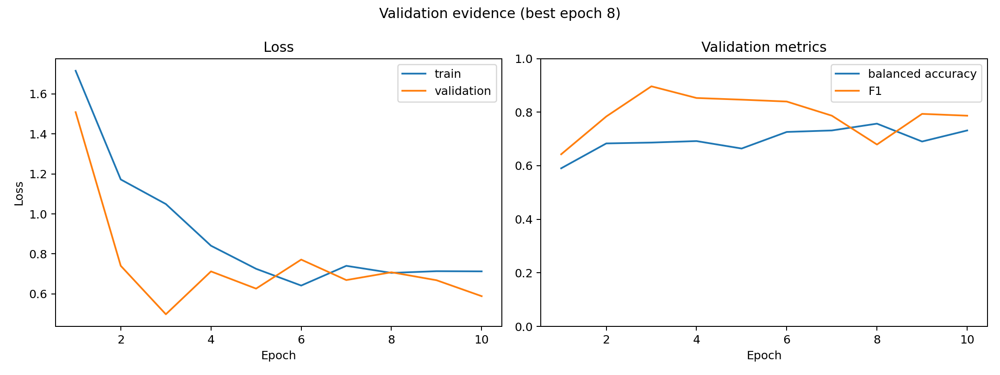

**Figure interpretation:** The left panel compares training and validation loss. The right panel shows validation balanced accuracy and F1 by epoch. These curves are evidence of training dynamics, not a proof of generalisation. The selected checkpoint corresponds to the highest validation balanced accuracy, not simply the last epoch.

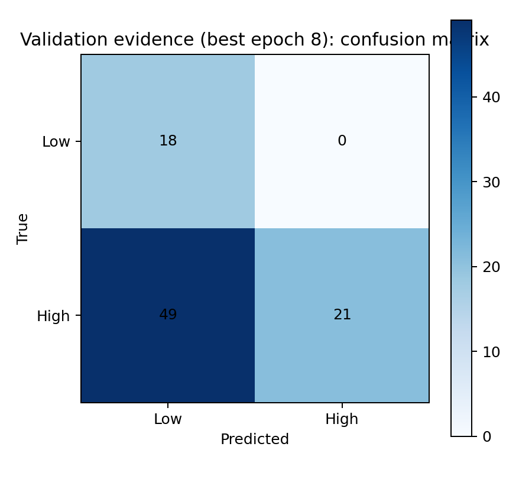

**Figure interpretation:** This is the best-validation checkpoint's confusion matrix at the validation-selected threshold. It makes class asymmetry visible and should be read alongside sensitivity, specificity, and predicted-positive rate.

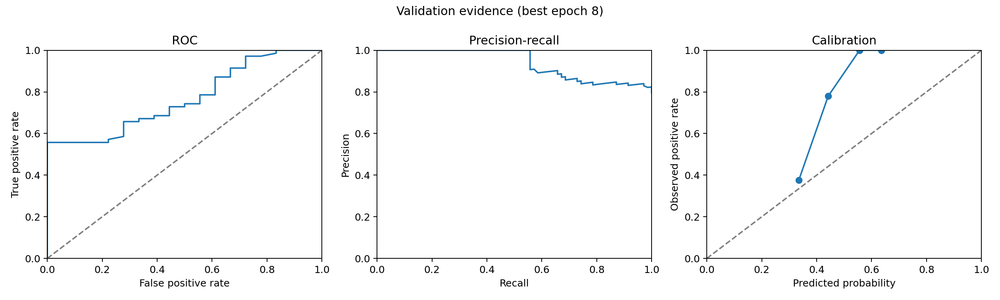

**Figure interpretation:** These are historical candidate diagnostics retained for provenance. The current final calibration result is the development-OOF-only temperature-scaling artifact at [`outputs/calibration/repaired/reliability.png`](../outputs/calibration/repaired/reliability.png); it is diagnostic evidence, not clinical probability validation.

### 9.2 Modality matrix figure

Each `*_modalities.png` file is a 4 × 3 grid:

- rows: T1ce, T1n, T2f, T2w;
- columns: axial, coronal, and sagittal views;
- slice planes: selected around the peak of the Grad-CAM map;
- background: grayscale intensity from the corresponding MRI channel.

The figure is not a segmentation mask. It is a way to confirm that the input channels contain structured brain MRI content and to see the anatomical context around the model's most responsive location.

### 9.3 Attention figure

Each `*_attention.png` file has two rows and three columns:

- **Top row — Grad-CAM:** a coarse class-discriminative map from the final convolutional block. Warmer colours indicate larger normalised Grad-CAM response for the class the model predicted.
- **Bottom row — input saliency:** absolute input-gradient magnitude, collapsed across the four channels by taking the maximum. Warmer colours indicate larger local sensitivity of the predicted logit to input changes.
- **Columns:** axial, coronal, and sagittal views.

Grad-CAM is useful for asking, “Which spatial regions contributed to this prediction?” Saliency is useful for asking, “Which input voxels produce large local changes in the prediction?” Neither answers, “Where is the tumour?” without segmentation labels and a validated localisation protocol.

The maps are normalised independently per case. Therefore, a bright region in one case is not quantitatively comparable to the same colour in another case.

---

## 10. Historical case-comparison examples (superseded)

The following case comparison was written for the earlier candidate and is retained only as provenance. For the completed run, use the four cases and probabilities in [`visual_evidence_manifest.json`](../outputs/explainability/repaired_final/visual_evidence_manifest.json), not the historical table below.

- **Best case:** highest confidence among correctly classified test cases, using distance from the 0.46 threshold.
- **Medium/ambiguous case:** probability closest to the threshold, representing a low-margin decision.
- **Least/worst case:** most confident incorrect test prediction, using distance from the threshold.

This is an evidence-selection rule, not a new performance metric.

### 10.1 Case comparison table

| Case archetype | Case | True proxy | Model probability HIGH | Predicted proxy | Correct? | Distance from threshold | Research interpretation |
|---|---|---:|---:|---:|---|---:|---|
| Best overall correct | `BraTS-GLI-02720-100` | LOW | 0.2935 | LOW | Yes | 0.1665 | Strong correct LOW decision |
| Correct HIGH example | `BraTS-GLI-02307-101` | HIGH | 0.5947 | HIGH | Yes | 0.1347 | Strongest available correct HIGH example in the visual set |
| Medium/ambiguous | `BraTS-GLI-02225-101` | LOW | 0.4661 | HIGH | No | 0.0061 | Almost exactly on the operating boundary; expected uncertainty |
| Least/worst confident error | `BraTS-GLI-02651-100` | HIGH | 0.2861 | LOW | No | 0.1739 | Strong false-LOW error; high-value failure case for future analysis |

### 10.2 Best case: `BraTS-GLI-02720-100`

**Measured evidence:** true LOW proxy, predicted LOW, `p(HIGH)=0.2935`, correct. The case has the largest confidence margin among correct locked-test examples.

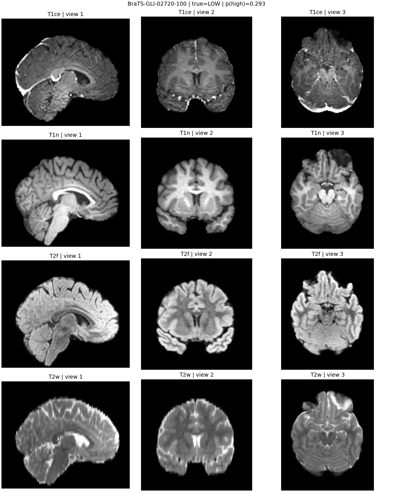

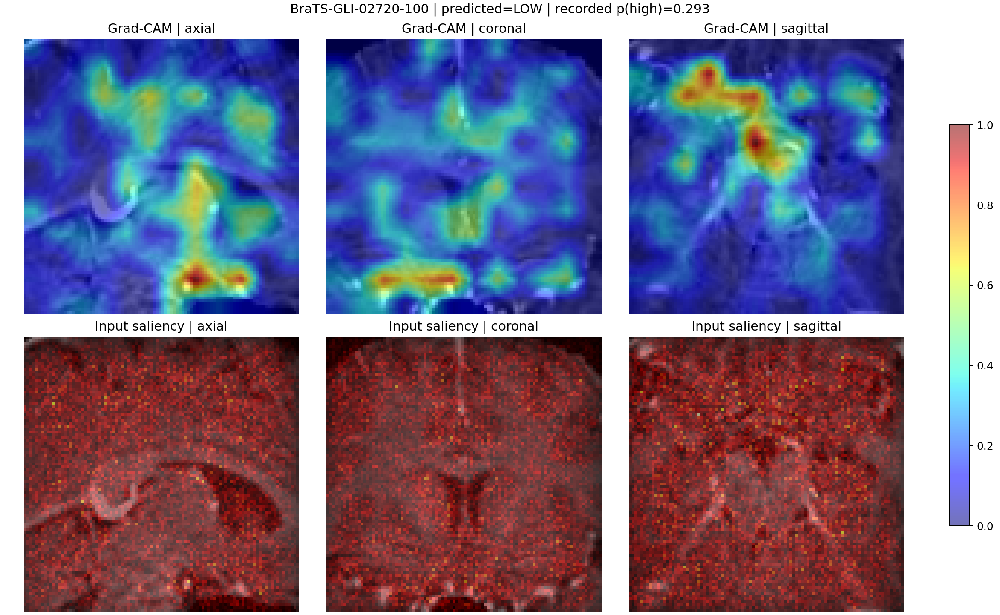

**How to present this case:**

> “This is a strong correct example. The model places the case well below the HIGH decision threshold, and the visual evidence shows the spatial regions that drove the LOW prediction. The map demonstrates model behaviour, not a clinically verified lesion boundary.”

**What this case supports:**

- the pipeline can produce a confident correct decision;
- the prediction is repeatable from the saved checkpoint;
- the visualiser can link a scalar probability to spatial evidence.

**What it does not support:**

- that the highlighted structure is the causal biological reason for the proxy label;
- that the same confidence is calibrated across patients;
- that the model would work on independent clinical labels.

### 10.3 Correct HIGH example: `BraTS-GLI-02307-101`

**Measured evidence:** true HIGH proxy, predicted HIGH, `p(HIGH)=0.5947`, correct. This is a useful counterweight to the LOW correct example because it shows the model can also produce a correct HIGH decision, though the probability is not extremely close to one.

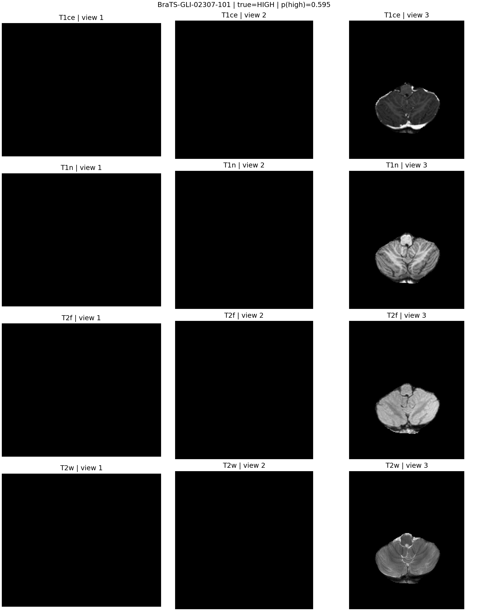

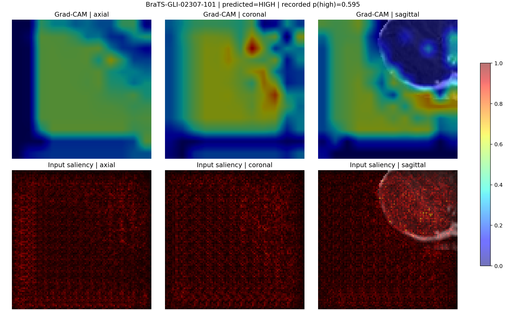

**Panel interpretation:** The probability is above the threshold but remains moderate. This should be described as a correct classification with moderate confidence, not as an emphatic high-grade decision.

### 10.4 Medium/ambiguous case: `BraTS-GLI-02225-101`

**Measured evidence:** true LOW proxy, predicted HIGH, `p(HIGH)=0.4661`, only `0.0061` from the threshold. This is the closest locked-test case to the decision boundary among the selected evidence.

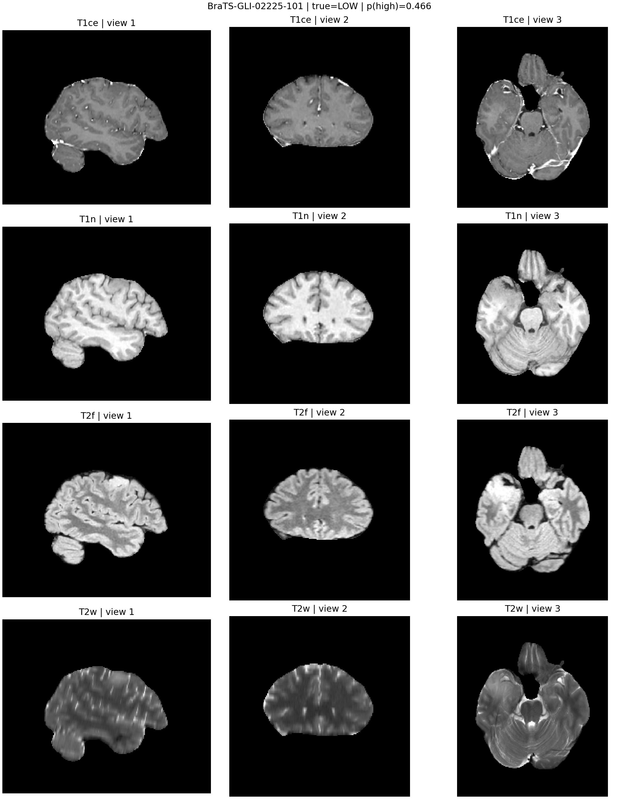

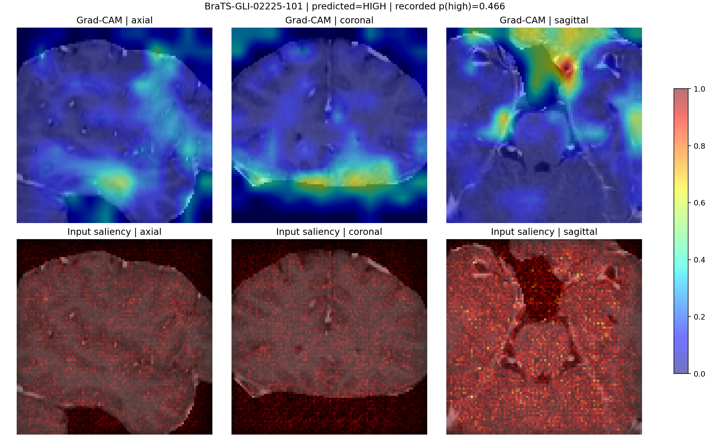

**Research interpretation:** This is a boundary case, not a strongly confident failure. A small change in crop, calibration, or threshold could change the label. It is precisely the type of case for which calibration and uncertainty estimation are more informative than a hard binary output.

The visual map should be inspected for whether attention concentrates consistently within brain tissue or spills toward edges/background. Even if it appears plausible, the absence of an independent segmentation target means this remains a hypothesis for future testing.

### 10.5 Least/worst case: `BraTS-GLI-02651-100`

**Measured evidence:** true HIGH proxy, predicted LOW, `p(HIGH)=0.2861`. This is a confident false-LOW case, with a probability margin of `0.1739` from the threshold.

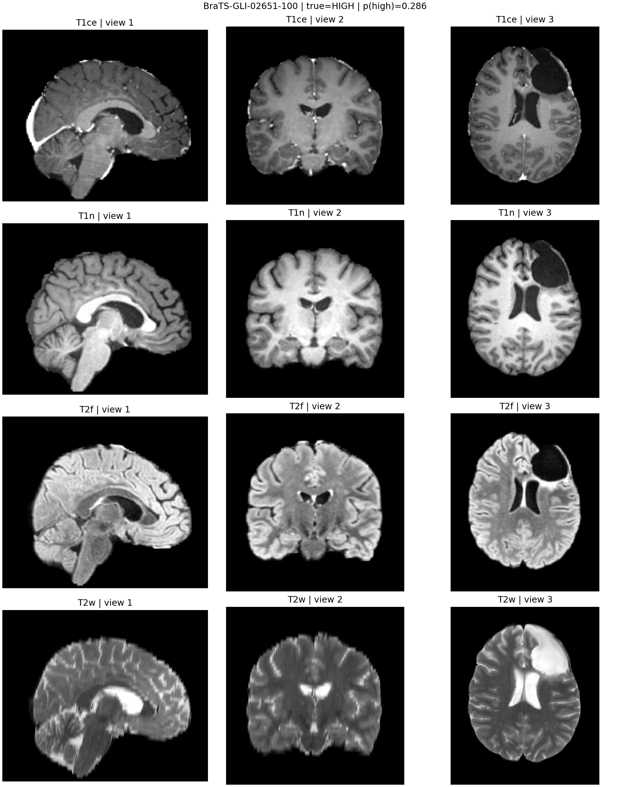

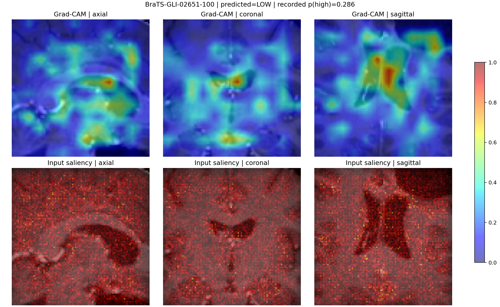

**Research interpretation:** This is the most important failure example for improvement. It suggests that the current crop/model combination can miss evidence associated with a HIGH proxy case, or that the ET-derived proxy is not reliably recoverable from the chosen image representation. The correct response is not to hide the case; it is to retain it for error analysis, test multi-crop consistency on development data, inspect tumour-region coverage, and evaluate independent labels later.

### 10.6 What the case comparison says collectively

The four examples show four distinct behaviours:

1. **Clear correct LOW:** the model can separate some cases with a useful margin.
2. **Correct HIGH but moderate probability:** positive ranking exists without extreme confidence.
3. **Near-threshold false HIGH:** the decision boundary is uncertain and likely sensitive to calibration.
4. **Confident false LOW:** the model has a meaningful failure mode that is not explained by threshold ambiguity alone.

This is more informative than showing only the best image. A research panel should see at least one success, one moderate case, one ambiguous case, and one confident failure.

---

## 11. How to read the visualisations without overclaiming

### 11.1 Valid uses

The current figures are appropriate for:

- checking that the model's response is spatially structured rather than numerically opaque;
- comparing correct and incorrect predictions;
- identifying possible background or edge attention;
- proposing future hypotheses about crop coverage and MRI sequence contribution;
- communicating model behaviour to a panel;
- deciding which cases deserve expert review.

### 11.2 Invalid uses

The current figures cannot prove:

- tumour segmentation;
- causal reasoning;
- clinical localisation accuracy;
- that the brightest region is pathological;
- that the model used T1ce rather than a shortcut in another channel;
- that a visually plausible explanation is a faithful explanation of the biological process.

Grad-CAM papers themselves frame the method as a visual explanation/localisation technique. It is a diagnostic tool for model behaviour, not a replacement for ground-truth segmentation or clinical review. The [Grad-CAM paper](https://openaccess.thecvf.com/content_ICCV_2017/html/Selvaraju_Grad-CAM_Visual_Explanations_ICCV_2017_paper.html) is the method reference; the limitations above are the conservative interpretation required for this dataset.

### 11.3 Why both Grad-CAM and saliency were included

Grad-CAM is lower-resolution and class-discriminative because it uses gradients entering a convolutional feature block. Input saliency is higher-resolution but often noisier because it reports local input sensitivity. Agreement between them can strengthen a hypothesis; disagreement is valuable evidence that the explanation is unstable or the model is using diffuse cues.

The report does not use Integrated Gradients in the selected implementation. Integrated Gradients is a possible future comparison method; its original reference is [Sundararajan, Taly, and Yan, 2017](https://proceedings.mlr.press/v70/sundararajan17a.html).

---

## 12. Baseline comparison and honest interpretation

### 12.1 Majority-class baseline

The locked test set contains 71 HIGH and 17 LOW cases. A classifier that always predicts HIGH obtains:

- accuracy: `71 / 88 = 0.8068`;
- balanced accuracy: `(1.0 + 0.0) / 2 = 0.5`;
- AUROC: `0.5` because it has no ranking ability;
- specificity: `0.0`.

The repaired model obtains lower raw accuracy but higher balanced accuracy and AUROC. This means it trades majority-class correctness for some ability to discriminate cases. Whether that trade is useful depends on the real application cost of missed HIGH cases and false HIGH cases. Those costs were not supplied and should not be invented.

### 12.2 Historical repository scores

Older repository notes report much higher accuracy for older scripts and an ET-feature model. Those numbers are not used as current scientific evidence because:

- the earlier path had duplicate-row and split concerns;
- the older model definitions do not match the repaired checkpoint;
- the feature model had direct access to ET-derived scalar information related to the label-construction rule;
- the old handoff contains inconsistent row/split totals;
- the current audited report uses a different canonical data and evaluation contract.

The repaired result is therefore lower but more defensible. A judge panel should prefer a lower score with a clear data contract over a near-perfect score produced by label leakage.

---

## 13. Reproducibility evidence

### 13.1 Source-of-truth artifacts

| Artifact | Purpose |
|---|---|
| [`preprocessed_data_report.json`](../outputs/data_quality/preprocessed_data_report.json) | Complete file and label audit |
| [`summary.json`](../outputs/cv/full_epoch_baseline_5fold_5ep/summary.json) | Five-fold metrics, pooled OOF predictions, baseline, and bootstrap intervals |
| [`fold_manifest.json`](../outputs/cv/full_epoch_baseline_5fold_5ep/fold_manifest.json) | Exact development fold assignments |
| [`out_of_fold_predictions.csv`](../outputs/cv/full_epoch_baseline_5fold_5ep/out_of_fold_predictions.csv) | One prediction for each of 788 development cases |
| [`calibration.json`](../outputs/calibration/repaired/calibration.json) | Development-only temperature, threshold, Brier, and ECE |
| [`best_checkpoint.pth`](../outputs/training/repaired_final/best_checkpoint.pth) | Final development-only model weights and metadata |
| [`development_manifest.json`](../outputs/training/repaired_final/development_manifest.json) | Final fit cases and locked-test exclusion |
| [`history.csv`](../outputs/training/repaired_final/history.csv) | Five-epoch final-fit resource evidence |
| [`summary.json`](../outputs/evaluation/repaired_final/summary.json) | Final locked-test metrics and calibration metadata |
| [`test_predictions.csv`](../outputs/evaluation/repaired_final/test_predictions.csv) | Per-case final locked-test predictions |
| [`visual_evidence_manifest.json`](../outputs/explainability/repaired_final/visual_evidence_manifest.json) | Final case-level visual provenance |
| [`repaired_final_smoke`](../outputs/training/repaired_final_smoke/) | Three-epoch final-fit smoke evidence |
| [`test_training_contract.py`](../tests/test_training_contract.py) | Regression checks for the repaired seams |

### 13.2 Checks executed

```text
python -m unittest discover -s tests -v  → 9 tests passed
python -m compileall -q src scripts     → passed
Final five-fold CV                       → 788/788 OOF cases, no test evaluation
Bootstrap uncertainty                    → deterministic 95% intervals saved
Temperature scaling                      → development OOF only
Final 3-epoch CUDA smoke                 → completed under memory guards
Final five-epoch development fit         → completed under memory guards
Final locked-test evaluation             → run once on final checkpoint
Visual evidence assertion                → 4 cases, figures and JSON present
```

### 13.3 Final-test reproducibility boundary

The final locked-test evaluator was intentionally run once, as predeclared. Its prediction CSV is frozen at:

```text
`outputs/evaluation/repaired_final/test_predictions.csv`
```

The final summary reports accuracy `0.7045`, balanced accuracy `0.5261`, F1
`0.8169`, AUROC `0.7672`, and confusion matrix `TN=4, FP=13, FN=13, TP=58`.

This is evidence of evaluator reproducibility for the current checkpoint. It is not evidence that the model generalises to another dataset.

---

## 14. Limitations and threats to validity

### 14.1 Label validity

The target is an ET-derived proxy. This is the largest scientific limitation. A better score may simply indicate better recovery of enhancing-tumour presence, not better histopathological grade prediction.

### 14.2 Sample size

The locked test contains 88 cases, including only 17 LOW-proxy cases. A handful of cases can materially change sensitivity, specificity, and balanced accuracy. The development OOF bootstrap intervals reduce uncertainty around the development estimate, but no test-set confidence interval is reported because the locked test was evaluated once.

### 14.3 One selected split

The final result still uses one seed-42 subject-disjoint test split, but the 788-case development partition now has complete five-fold subject-disjoint OOF coverage. The locked-test score remains a single-split estimate and should not be treated as external validation.

### 14.4 Crop coverage

The model sees a 96³ crop rather than the full volume. Crop-first loading is required for memory safety, but it can omit global context or tumour regions. The train crop policy uses random candidates; validation/test use deterministic candidate anchors. Multi-crop aggregation is a future development-set experiment, not a test-set tuning opportunity.

### 14.5 Probability calibration

The reported `p(HIGH)` is not a validated clinical probability. Temperature scaling was fit on development OOF predictions only: temperature `0.8011`, Brier `0.1973 → 0.1960`, and ECE `0.2366 → 0.2279`. Calibration improves diagnostic reliability on the development predictions but does not establish clinical probability calibration on another cohort.

### 14.6 Explanation validity

Grad-CAM and saliency are qualitative. The four final attention figures were inspected for missing or saturated outputs; they contain finite, structured maps, with some diffuse/noisy saliency and edge-adjacent responses. No expert segmentation comparison, deletion/insertion faithfulness test, counterfactual test, or inter-rater assessment has been performed. The maps are not tumour masks.

### 14.7 External validity

The report has no external hospital, scanner, demographic, or acquisition-protocol validation. The model was trained from scratch on one preprocessed dataset and should not be deployed outside this research setting.

### 14.8 Resource interpretation

The memory guards show that the tested configuration fits the hardware. They do not mean that GPU utilisation is always 100%, that the process can never encounter an operating-system access violation, or that the full dataset is resident in RAM. Memory-mapped I/O intentionally allows the operating system to page data as needed.

---

## 15. Completed MRI gate and next research steps

CT remains out of scope for this report and should not be started yet.

### Completed phases

1. The 88-case seed-42 test partition remained locked.
2. The 788-case development partition was used for five subject-disjoint folds.
3. Every development case received exactly one OOF prediction.
4. Fold metrics, pooled OOF metrics, and deterministic bootstrap intervals were saved.
5. A development-only temperature and threshold were fit and frozen before the final test evaluation.
6. The final development-only checkpoint was trained for five epochs after a three-epoch CUDA smoke test.
7. The locked test was evaluated exactly once and final visual evidence was generated for four cases.

### Next research steps

1. Validate the target against independent pathology/WHO-grade labels rather than the ET-derived proxy.
2. Test external cohorts, scanners, acquisition protocols, and demographic shifts.
3. Compare explanation maps with expert segmentation and run deletion/insertion faithfulness checks.
4. Evaluate multi-crop consistency and uncertainty/abstention policies on development data only.
5. Add CT only after a genuinely paired, registered, independently labelled CT dataset exists.

### Highest-value scientific improvement

The most scientifically valuable improvement is not necessarily a larger CNN. It is a target with independent clinical provenance: pathology/WHO grade or another annotation not derived from the same ET signal the model sees in the MRI.

---

## 16. Judge-panel presentation script

### Opening — problem and contribution

> “This project evaluates a compact 3D MRI classifier for a binary BraTS grade proxy under a strict 2 GB VRAM and 3 GB RAM budget. The main contribution of this phase is not a claim of clinical-grade accuracy. It is a repaired, leakage-safe, auditable pipeline that produces reproducible scores and visual evidence.”

### Data credibility

> “We inspected all 882 preprocessed volumes. Every valid file matched the required four-channel shape and float32 type, with no invalid files, no missing labelled cases, and no conflicting duplicate labels. The raw 994-row label table was reduced to 876 unique cases. Repeated acquisitions were kept within one subject-disjoint split.”

### Method

> “The network has 501,289 parameters and uses three-dimensional convolutions, GroupNorm, LeakyReLU activations, global average pooling, and a binary head. We use memory-mapped crop-first loading, balanced batches, mixed precision, and gradient accumulation. GroupNorm is appropriate because the physical batch is only two.”

### Results

> “Five subject-disjoint folds cover all 788 development cases, with mean best AUROC 0.7987 and mean balanced accuracy 0.7592. On the locked test, the calibrated AUROC is 0.7672, but balanced accuracy is 0.5261 and accuracy is 0.7045 versus the 0.8068 majority-HIGH baseline. The ranking signal is measurable, while the current thresholded classifier remains weak.”

### Visual evidence

> “For each selected case we show all four MRI channels in three orthogonal views, then Grad-CAM and input-gradient saliency. The best case shows a confident correct decision, the medium case lies almost exactly on the threshold, and the worst case is a confident false-LOW error. Showing the failure case is important because it prevents explanation visuals from becoming promotional cherry-picking.”

### Limitations and next step

> “The label is an ET-derived proxy rather than independent WHO grade. The five-fold MRI-only validation and development-only calibration gate is complete, but the locked test is still one small split and the thresholded result is weak. CT is not part of this phase. The next defensible step is independent label validation and external MRI testing before adding new modalities.”

---

## 17. Questions a judge may ask

### Why is accuracy below the majority baseline?

Because the majority baseline predicts HIGH for all 88 test cases and benefits from the 71:17 test imbalance. The repaired model predicts both classes and therefore sacrifices raw accuracy to achieve non-trivial specificity and balanced accuracy. The result is not strong enough yet; the report states that plainly.

### Why not report only AUROC?

AUROC evaluates ranking over all thresholds. A deployment decision still requires an operating threshold. The current test AUROC of 0.7672 says the ranking is above random, while sensitivity `0.8169` and specificity `0.2353` show that the chosen operating point is not balanced.

### Why was the threshold 0.53 used?

It was selected from development OOF predictions after temperature scaling and then frozen for the locked test. The test labels were not used to select it. The pooled raw-OOF threshold diagnostic was `0.52`; the final calibrated threshold is `0.53`.

### Why use GroupNorm instead of BatchNorm?

The physical batch is two because of 3D activation memory. GroupNorm does not depend on batch-wide statistics and is therefore a safer normalization choice for small-batch volumetric training. This is the direct motivation in [Wu and He, 2018](https://openaccess.thecvf.com/content_ECCV_2018/html/Yuxin_Wu_Group_Normalization_ECCV_2018_paper.html).

### What do the heatmaps prove?

They show where the current model's gradients and final feature maps respond for a selected prediction. They do not prove tumour localisation, causality, or clinical validity. Segmentation-ground-truth comparison is required for a stronger explanation claim.

### Why was the high-performing feature model excluded?

Its ET-derived scalar features overlap with the rule used to generate `grade_proxy`. It can recover the label construction mechanism without demonstrating independent MRI-based grading. Reporting it as a valid clinical model would be leakage.

### Why not add CT now?

The current verified BraTS input is MRI-only. Adding CT without a genuinely paired, registered, independently labelled dataset would create a new data problem rather than solve the current validation problem. CT is deliberately deferred until the MRI-only protocol is complete.

### What would make the work stronger?

Five-fold out-of-fold evaluation, calibrated probabilities, independent clinical-grade labels, external validation, and an expert-reviewed explanation/segmentation comparison would materially strengthen the scientific claim.

---

## 18. Conclusion

The repaired pipeline is a credible engineering and research baseline under severe hardware constraints. It solves several real correctness problems: duplicate labels, subject leakage risk, memory-heavy loading, background crops, loss-shape bugs, test contamination, and mislabeled visualization backgrounds.

The measured model is not yet a strong balanced classifier. Its locked-test accuracy is below the majority baseline, its specificity is only `0.2353`, and the test set is small. The strongest defensible claim is narrower and more useful:

> A compact, memory-safe, subject-disjoint 3D MRI model can learn a non-random ranking signal for this dataset's ET-derived grade proxy, but the current evidence is insufficient for independent clinical grading or deployment.

That is a sound research result because it exposes both what works and what remains unresolved. The MRI-only cross-validation and calibration protocol is complete; the next step is independent label validation and external MRI testing, not adding CT or hiding the failure cases.

---

## 19. References

1. Pease, A. et al. **The 2024 Brain Tumor Segmentation (BraTS) Challenge: Glioma Segmentation on Post-treatment MRI.** 2024. [arXiv record](https://arxiv.org/abs/2405.18368).
2. BraTS documentation. **BraTS documentation and MRI sequence interface.** [Official documentation](https://brats.readthedocs.io/en/stable/).
3. Wu, Y.; He, K. **Group Normalization.** ECCV 2018. [CVF open-access paper](https://openaccess.thecvf.com/content_ECCV_2018/html/Yuxin_Wu_Group_Normalization_ECCV_2018_paper.html).
4. He, K.; Zhang, X.; Ren, S.; Sun, J. **Delving Deep into Rectifiers: Surpassing Human-Level Performance on ImageNet Classification.** ICCV 2015. [CVF open-access paper](https://openaccess.thecvf.com/content_iccv_2015/html/He_Delving_Deep_into_ICCV_2015_paper.html).
5. Lin, T.-Y. et al. **Focal Loss for Dense Object Detection.** ICCV 2017. [CVF open-access paper](https://openaccess.thecvf.com/content_ICCV_2017/html/Lin_Focal_Loss_for_ICCV_2017_paper.html).
6. Cui, Y. et al. **Class-Balanced Loss Based on Effective Number of Samples.** CVPR 2019. [CVF open-access paper](https://openaccess.thecvf.com/content_CVPR_2019/html/Cui_Class-Balanced_Loss_Based_on_Effective_Number_of_Samples_CVPR_2019_paper.html).
7. Loshchilov, I.; Hutter, F. **Decoupled Weight Decay Regularization.** ICLR 2019. [OpenReview paper](https://openreview.net/forum?id=Bkg6RiCqY7).
8. scikit-learn developers. **`StratifiedGroupKFold` API documentation.** [Official documentation](https://scikit-learn.org/stable/modules/generated/sklearn.model_selection.StratifiedGroupKFold.html).
9. Selvaraju, R. R. et al. **Grad-CAM: Visual Explanations from Deep Networks via Gradient-Based Localization.** ICCV 2017. [CVF open-access paper](https://openaccess.thecvf.com/content_ICCV_2017/html/Selvaraju_Grad-CAM_Visual_Explanations_ICCV_2017_paper.html).
10. Simonyan, K.; Vedaldi, A.; Zisserman, A. **Deep Inside Convolutional Networks: Visualising Image Classification Models and Saliency Maps.** 2014. [arXiv record](https://arxiv.org/abs/1312.6034).
11. Sundararajan, M.; Taly, A.; Yan, Q. **Axiomatic Attribution for Deep Networks.** ICML 2017. [PMLR paper](https://proceedings.mlr.press/v70/sundararajan17a.html).
12. Guo, C.; Pleiss, G.; Sun, Y.; Weinberger, K. Q. **On Calibration of Modern Neural Networks.** ICML 2017. [PMLR paper](https://proceedings.mlr.press/v70/guo17a.html).
13. Menze, B. H. et al. **The Multimodal Brain Tumor Image Segmentation Benchmark (BRATS).** IEEE Transactions on Medical Imaging, 2015. [DOI and paper record](https://doi.org/10.1109/TMI.2014.2377694).
14. Bakas, S. et al. **Advancing The Cancer Genome Atlas glioma MRI collections with expert segmentation labels and radiomic features.** Scientific Data, 2017. [DOI and publisher page](https://doi.org/10.1038/sdata.2017.117).
15. Yagis, E. et al. **Effect of data leakage in brain MRI classification using 2D convolutional neural networks.** Scientific Reports, 2021. [DOI and publisher page](https://doi.org/10.1038/s41598-021-01681-w).

---

## 20. Local research artefacts consulted

- [`research/07_efficient_data_loading.md`](07_efficient_data_loading.md) — memory mapping, lazy loading, and crop-first rationale.
- [`research/13_uncertainty_calibration.md`](13_uncertainty_calibration.md) — calibration and uncertainty methods reserved for the next phase.
- [`research/phase0_dataset_selection.md`](phase0_dataset_selection.md) — dataset availability and CT/MRI scope; CT is not part of this report.
- [`research/ml_plateau_research.md`](ml_plateau_research.md) — repository research notes on class imbalance and training stability.

**Evidence boundary:** all numerical results and figure descriptions in this document were derived from the repository artifacts listed above. Citation links support general methodological rationale; they are not substitutes for independent validation of this experiment.
