# 🔗 Research Cross-Reference Index

> All 42+ research files linked by dependency, theme, and reading order.
> Start at any file → follow arrows → find everything related.

---

## Category Dependency Graph

```mermaid
graph TD
    subgraph Foundation["Foundation — read first"]
        C1[cat1: Brain Tumor Imaging Basics]
        C2[cat2: Progression Monitoring]
        C3[cat3: DL in Medical Imaging]
    end

    subgraph CoreMethods["Core Methods"]
        C6[cat6: AI Architectures]
        C5[cat5: Segmentation]
        C7[cat7: Registration & Segmentation]
        C4[cat4: PET-MRI Fusion]
        C8[cat8: CT+MRI Fusion]
        C9[cat9: Multi-Center Harmonization]
        C12[cat12: Data Augmentation]
        C13[cat13: Transfer Learning]
        C10[cat10: Uncertainty Quantification]
        C11[cat11: Explainable AI]
        C11C[cat11: XAI Clinical]
        C14[cat14: Clinical Deployment]
        C15[cat15: Ethical Considerations]
        C15B[cat15: Ethical Bias]
    end

    subgraph Evaluation["Evaluation"]
        C17[cat17: Evaluation Metrics]
        C18[cat18: Radiologist Comparison]
        C19[cat19: Prior Work]
    end

    subgraph Datasets["Datasets — Phase 1"]
        D16a[16a: Dataset Inventory]
        D16b[16b: Dataset Profiles]
        D16d[16d: Longitudinal Deep-Dive]
        D16f[16f: Preprocessing]
        D16g[16g: Gap Analysis]
        D16h[16h: Access & Licensing]
    end

    subgraph Phase1Reports["Phase 1 Reports"]
        R01[01: CNN Backbones]
        R02[02: Medical Segmentation CNN]
        R03[03: Transformer Hybrid]
        R04[04: Multimodal Fusion]
        R05[05: Longitudinal Analysis]
        R06[06: Final Report]
        R07[07: Efficient Data Loading]
        R09[09: Radiomics Fusion]
        R10[10: Self-Supervised]
        R11[11: Generative Augmentation]
        R12[12: Explainability]
        R13[13: Uncertainty Calibration]
        R14[14: Survival Analysis]
        R15[15: Federated Learning]
    end

    C1 --> C2
    C1 --> C3
    C2 --> C17
    C2 --> C18
    C3 --> C6
    C3 --> C5
    C3 --> C10
    C3 --> C11
    C5 --> C7
    C5 --> R02
    C6 --> R01
    C6 --> R03
    C6 --> C10
    C4 --> C8
    C4 --> R04
    C8 --> C7
    C8 --> C9
    C8 --> R04
    C9 --> D16g
    C12 --> C5
    C12 --> R11
    C13 --> C6
    C13 --> C3
    C10 --> R13
    C10 --> C14
    C11 --> R12
    C11 --> C11C
    C11 --> C14
    C14 --> C15
    C14 --> C18
    C15 --> C15B
    C17 --> C18
    C19 --> C2
    C19 --> C6
    C19 --> C17

    D16a --> D16b
    D16a --> D16d
    D16a --> D16g
    D16b --> D16h
    D16d --> D16g
    D16f --> D16h

    R01 --> R02
    R02 --> R03
    R02 --> R04
    R03 --> R06
    R04 --> R06
    R05 --> R06
    R06 --> R07
    R06 --> R14
    R10 --> R12
    R10 --> R13
```



---

## Reading Flow (Topological Order)

```
Layer 0 — Foundations
  └─ cat1 → cat2 → cat3

Layer 1 — Core Methods (in any order)
  └─ cat6 → cat5 → cat7
  └─ cat4 → cat8 → cat9
  └─ cat12 → cat13

Layer 2 — Analysis & Trust
  └─ cat10 → cat11 → cat11_clinical
  └─ cat14 → cat15 → cat15_bias

Layer 3 — Evaluation
  └─ cat17 → cat18 → cat19

Phase 1 Reports — parallel track
  └─ 01 → 02 → 03 → 04 → 05 → 06
  └─ 06 → 07 → 14 (survival)
  └─ 10 → 12 → 13
  └─ 09 → 11 → 15
```

---

## Inter-File Cross-References

### cat1_brain_tumour_imaging_basics.md
→ See also: `cat4_pet_mri_fusion.md` (PET sequences), `cat5_brain_tumor_segmentation.md` (segmentation inputs), `02_medical_segmentation_cnn.md` (network inputs)

### cat2_tumour_progression_monitoring.md
→ See also: `cat17_evaluation_metrics_progression.md` (metrics for progression), `cat18_radiologist_comparison.md` (RANO in practice), `05_longitudinal_analysis.md` (DL methods), `cat19_direct_prior_work_base_papers.md` (progression prediction papers)

### cat3_deep_learning_medical_imaging.md
→ See also: `01_foundational_cnn_backbones.md` (backbones), `03_transformer_hybrid.md` (transformers), `10_self_supervised.md` (pretraining), `cat6_ai_architectures.md` (architectures)

### cat4_pet_mri_fusion.md
→ See also: `cat8_ct_mri_multimodal_fusion.md` (CT+MRI), `04_multimodal_fusion.md` (fusion architectures), `cat9_multi_center_harmonization.md` (harmonization)

### cat5_brain_tumor_segmentation.md
→ See also: `02_medical_segmentation_cnn.md` (architectures), `cat7_registration_segmentation.md` (registration), `16f_preprocessing_pipelines.md` (preprocessing)

### cat6_ai_architectures.md
→ See also: `01_foundational_cnn_backbones.md` (backbone details), `03_transformer_hybrid.md` (transformer variants), `cat10_uncertainty_quantification.md` (architectural uncertainty), `14_survival_analysis.md` (survival architectures)

### cat7_registration_segmentation.md
→ See also: `cat8_ct_mri_multimodal_fusion.md` (cross-modal registration), `05_longitudinal_analysis.md` (longitudinal registration), `cat17_evaluation_metrics_progression.md` (registration metrics)

### cat8_ct_mri_multimodal_fusion.md
→ See also: `04_multimodal_fusion.md` (fusion architectures), `cat4_pet_mri_fusion.md` (PET-MRI), `cat9_multi_center_harmonization.md` (harmonization), `cat19_multimodal_fusion_experimental.md` (experimental notes)

### cat9_multi_center_harmonization.md
→ See also: `16g_dataset_gap_analysis.md` (harmonization gaps), `15_federated_learning.md` (federated approach), `16h_access_licensing_ethics.md` (multi-site consent)

### cat10_uncertainty_quantification.md
→ See also: `13_uncertainty_calibration.md` (calibration), `cat11_explainable_ai.md` (uncertainty + XAI), `cat14_clinical_deployment.md` (uncertainty in deployment)

### cat11_explainable_ai.md
→ See also: `12_explainability.md` (Phase 1 XAI), `cat11_explainable_ai_clinical.md` (clinical use), `10_self_supervised.md` (representation viz)

### cat11_explainable_ai_clinical.md
→ See also: `cat14_clinical_deployment.md` (deployment), `cat18_radiologist_comparison.md` (radiologist trust), `cat15_ethical_considerations.md` (trust + ethics)

### cat12_data_augmentation.md
→ See also: `11_generative_augmentation.md` (GAN/diffusion), `05_longitudinal_analysis.md` (temporal augmentation), `16f_preprocessing_pipelines.md` (preprocessing + augmentation)

### cat13_transfer_learning.md
→ See also: `10_self_supervised.md` (self-supervised pretraining), `01_foundational_cnn_backbones.md` (pretrained weights), `cat6_ai_architectures.md` (architecture transfer)

### cat14_clinical_deployment.md
→ See also: `cat11_explainable_ai_clinical.md` (clinical interpretability), `cat10_uncertainty_quantification.md` (uncertainty requirements), `cat15_ethical_considerations.md` (ethical deployment), `cat18_radiologist_comparison.md` (clinical validation)

### cat15_ethical_considerations.md
→ See also: `cat15_ethical_considerations_bias.md` (bias analysis), `cat14_clinical_deployment.md` (deployment ethics), `16h_access_licensing_ethics.md` (data ethics)

### cat15_ethical_considerations_bias.md
→ See also: `cat9_multi_center_harmonization.md` (dataset bias), `15_federated_learning.md` (bias in federated)

### cat17_evaluation_metrics_progression.md
→ See also: `cat2_tumour_progression_monitoring.md` (progression definition), `cat18_radiologist_comparison.md` (comparison metrics), `05_longitudinal_analysis.md` (longitudinal metrics)

### cat18_radiologist_comparison.md
→ See also: `cat2_tumour_progression_monitoring.md` (RANO criteria), `cat14_clinical_deployment.md` (clinical validation), `cat11_explainable_ai_clinical.md` (radiologist trust)

### cat19_direct_prior_work_base_papers.md
→ See also: `cat2_tumour_progression_monitoring.md` (progression context), `cat6_ai_architectures.md` (architecture context), `cat17_evaluation_metrics_progression.md` (metric context), `executive_summary.md` (synthesis)

### cat19_multimodal_fusion_experimental.md
→ See also: `cat8_ct_mri_multimodal_fusion.md` (verified fusion), `04_multimodal_fusion.md` (fusion architectures), `cat19_direct_prior_work_base_papers.md` (verified prior work)

### 01_foundational_cnn_backbones.md
→ See also: `02_medical_segmentation_cnn.md` (applied backbones), `cat6_ai_architectures.md` (architecture choices)

### 02_medical_segmentation_cnn.md
→ See also: `cat5_brain_tumor_segmentation.md` (category view), `03_transformer_hybrid.md` (transformer comparison)

### 03_transformer_hybrid.md
→ See also: `02_medical_segmentation_cnn.md` (CNN comparison), `04_multimodal_fusion.md` (multimodal transformers)

### 04_multimodal_fusion.md
→ See also: `cat8_ct_mri_multimodal_fusion.md` (CT+MRI specific), `09_radiomics_fusion.md` (radiomics + DL)

### 05_longitudinal_analysis.md
→ See also: `cat19_direct_prior_work_base_papers.md` (longitudinal papers), `cat2_tumour_progression_monitoring.md` (progression methods), `14_survival_analysis.md` (temporal survival)

### 06_final_report.md
→ See also: All Phase 1 reports (01–15), `executive_summary.md` (synthesis)

### 07_efficient_data_loading.md
→ See also: `16f_preprocessing_pipelines.md` (preprocessing), `16a_dataset_inventory.md` (dataset sources)

### 09_radiomics_fusion.md
→ See also: `04_multimodal_fusion.md` (fusion patterns), `cat8_ct_mri_multimodal_fusion.md` (multimodal radiomics)

### 10_self_supervised.md
→ See also: `cat13_transfer_learning.md` (transfer context), `12_explainability.md` (representation visualization), `13_uncertainty_calibration.md` (uncertainty from representations)

### 11_generative_augmentation.md
→ See also: `cat12_data_augmentation.md` (augmentation category), `15_federated_learning.md` (synthetic data for federated)

### 12_explainability.md
→ See also: `cat11_explainable_ai.md` (XAI category), `cat11_explainable_ai_clinical.md` (clinical XAI)

### 13_uncertainty_calibration.md
→ See also: `cat10_uncertainty_quantification.md` (UQ category), `10_self_supervised.md` (representation uncertainty)

### 14_survival_analysis.md
→ See also: `05_longitudinal_analysis.md` (longitudinal data), `cat6_ai_architectures.md` (survival architectures), `06_final_report.md` (synthesis)

### 15_federated_learning.md
→ See also: `cat9_multi_center_harmonization.md` (harmonization), `11_generative_augmentation.md` (synthetic data), `cat15_ethical_considerations.md` (privacy)

### 16a_dataset_inventory.md
→ See also: `16b_key_dataset_profiles.md` (detailed profiles), `16g_dataset_gap_analysis.md` (gaps)

### 16b_key_dataset_profiles.md
→ See also: `16a_dataset_inventory.md` (full list), `16h_access_licensing_ethics.md` (access terms)

### 16d_longitudinal_datasets_deepdive.md
→ See also: `16a_dataset_inventory.md` (inventory context), `05_longitudinal_analysis.md` (DL methods)

### 16f_preprocessing_pipelines.md
→ See also: `16e_dataset_comparison_matrix.csv` (data characteristics), `07_efficient_data_loading.md` (loading pipeline)

### 16g_dataset_gap_analysis.md
→ See also: `16a_dataset_inventory.md` (inventory), `executive_summary.md` (gap synthesis), `research_plan.md` (gap documentation)

### 16h_access_licensing_ethics.md
→ See also: `16b_key_dataset_profiles.md` (profiles), `cat15_ethical_considerations.md` (ethics)

### research_plan.md
→ See also: `executive_summary.md` (condensed), all Phase 1 and Phase 2 files

### executive_summary.md
→ See also: `research_plan.md` (full plan), `cat19_direct_prior_work_base_papers.md` (prior work), `16g_dataset_gap_analysis.md` (gaps)

---

## Citation File Cross-References

| BibTeX file | Related .md files | Status |
|-------------|-------------------|--------|
| `cat10_references.bib` | `cat10_uncertainty_quantification.md`, `13_uncertainty_calibration.md` | ⚠️ Unverified |
| `cat11_references.bib` | `cat11_explainable_ai.md`, `cat11_explainable_ai_clinical.md`, `12_explainability.md` | ⚠️ Unverified |
| `cat12_references.bib` | `cat12_data_augmentation.md`, `11_generative_augmentation.md` | ⚠️ Unverified |
| `cat15_references.bib` | `cat15_ethical_considerations.md`, `cat15_ethical_considerations_bias.md` | ⚠️ Unverified |
| `cat17_references.bib` | `cat17_evaluation_metrics_progression.md` | ✅ Verified |
| `cat18_references.bib` | `cat18_radiologist_comparison.md` | ✅ Verified |
| `cat19_references.bib` | `cat19_direct_prior_work_base_papers.md` | ✅ Verified |
| `bibtex/verified_foundational_references.bib` | `01_foundational_cnn_backbones.md`, `02_medical_segmentation_cnn.md` | ✅ Verified |
| `bibtex/cat4_references.bib` | `cat4_pet_mri_fusion.md` | ❌ Fabricated |
| `bibtex/cat5_references.bib` | `cat5_brain_tumor_segmentation.md` | ❌ Fabricated |
| `bibtex/cat8_references.bib` | `cat8_ct_mri_multimodal_fusion.md` | ❌ Fabricated |

---

## Quick Lookup: "I'm reading X, what's next?"

| If you're reading... | Then read... | Why |
|---------------------|-------------|-----|
| `cat1` | `cat4`, `cat5` | MRI/CT sequences → PET fusion, segmentation |
| `cat2` | `cat17`, `cat19` | Progression → how to measure it, prior work |
| `cat3` | `01`, `02`, `03` | DL overview → specific backbones |
| `cat8` | `04`, `cat9` | CT+MRI → fusion archs, harmonization |
| `cat11` | `12`, `cat14` | XAI → Phase 1 XAI → clinical use |
| `cat15` | `16h`, `15_federated` | Ethics → data licensing, federated privacy |
| `cat19` | `cat6`, `cat2` | Prior work → architecture choices, progression |
| `16a` | `16b`, `16d` | Inventory → profiles, longitudinal deep-dive |
| `06` | `07`, `14` | Final report → data loading, survival |
| `RECIPE.md` | `cat1`, `executive_summary.md` | File map → start reading |
