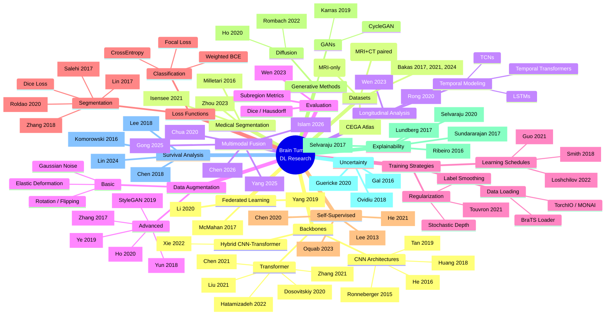

# Brain Tumour DL Research — Concept Mind Map

```mermaid
mindmap
  root((Brain Tumour
         DL Research))
    Backbones
      CNN Architectures
        ResNet [He 2016]
        U-Net [Ronneberger 2015]
        DenseNet3D [Huang 2018]
        EfficientNet [Tan 2019]
      Transformer
        ViT [Dosovitskiy 2020]
        Swin Transformer [Liu 2021]
        TransUNet [Chen 2021]
        Swin-UNETR [Hatamizadeh 2022]
        UNetR [Zhang 2021]
      Hybrid CNN-Transformer
        SegFormer [Xie 2022]
    Medical Segmentation
      nnU-Net [Isensee 2021]
      V-Net [Milletari 2016]
      ANET [Zhou 2023]
    Longitudinal Analysis
      CNN-LSTM [Rong 2020]
      RANO 2.0 [Wen 2023]
      Temporal Modeling
        LSTMs
        TCNs
        Temporal Transformers
    Data Augmentation
      Basic
        Rotation / Flipping
        Elastic Deformation
        Gaussian Noise
      Advanced
        GANs [StyleGAN 2019]
        Diffusion [Ho 2020]
        MixUp [Zhang 2017]
        CutMix [Yun 2018]
        Mosaic [Ye 2019]
    Training Strategies
      Data Loading
        TorchIO / MONAI
        BraTS Loader
      Learning Schedules
        Cosine Annealing [Loshchilov 2022]
        Warmup [Guo 2021]
        OneCycle [Smith 2018]
      Regularization
        DropPath [Touvron 2021]
        Stochastic Depth
        Label Smoothing
    Loss Functions
      Segmentation
        Dice Loss
        Focal Loss [Lin 2017]
        Tversky Loss [Salehi 2017]
        Boundary Loss [Zhang 2018]
        Asymmetric Dice [Roldao 2020]
      Classification
        CrossEntropy
        Weighted BCE
        Focal Loss
    Self-Supervised
      MAE [He 2021]
      MoCo v2 [Chen 2020]
      DINO / DINOv2 [Oquab 2023]
      Pseudo-Labeling [Lee 2013]
    Generative Methods
      GANs
        CycleGAN
        StyleGAN [Karras 2019]
      Diffusion
        DDPM [Ho 2020]
        Latent Diffusion [Rombach 2022]
    Explainability
      Grad-CAM [Selvaraju 2017]
      Grad-CAM++ [Selvaraju 2020]
      SHAP [Lundberg 2017]
      Integrated Gradients [Sundararajan 2017]
      LIME [Ribeiro 2016]
    Uncertainty
      MC Dropout [Gal 2016]
      Temperature Scaling [Guericke 2020]
      Deep Ensembles [Ovidiu 2018]
    Survival Analysis
      DeepSurv [Komorowski 2016]
      DeepHit [Lee 2018]
      Cox NN [Chen 2018]
      GLIOMA MRI [Lin 2024]
    Federated Learning
      FedAvg [McMahan 2017]
      FedOpt [Li 2020]
      Federated Concept [Yang 2019]
    Datasets
      BraTS [Bakas 2017, 2021, 2024]
      IBSR (MRI+CT paired)
      TCGA-GBM [CEGA Atlas]
      C-BRATS (MRI-only)
    Multimodal Fusion
      MRI+CT [Gong 2025]
      Radiomics+ViT [Yang 2025]
      Feature Fusion [Islam 2026]
      MRI-to-CT Translation [Chen 2026]
      PET+MRI [Chua 2020]
    Evaluation
      RANO 2.0 [Wen 2023]
      Dice / Hausdorff
      Subregion Metrics
```