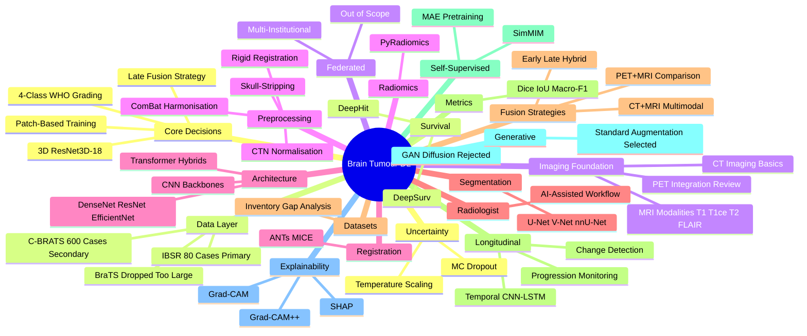
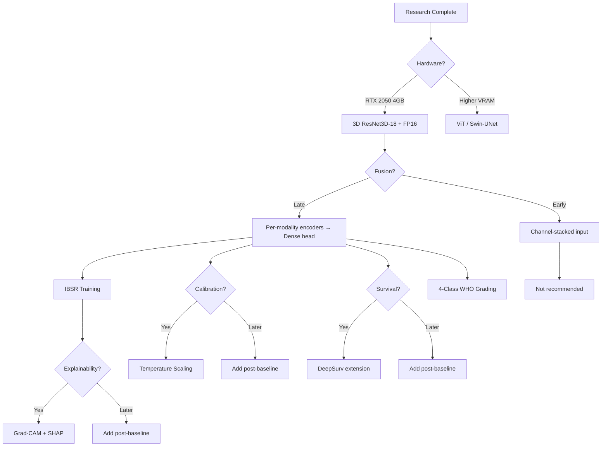
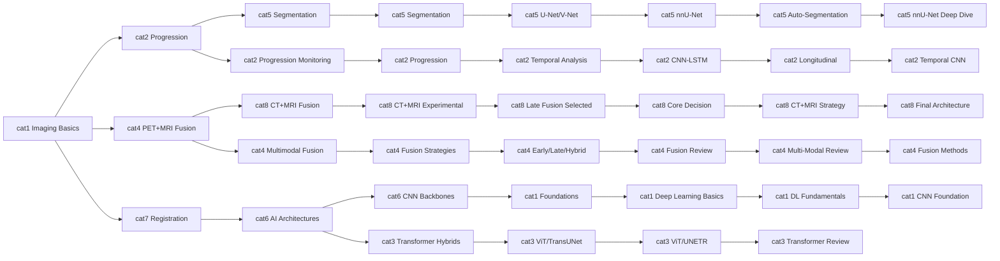

# Brain Tumour DL Research — Complete Mind Map

**All 19 research categories with cross-references and decision flow.**

---

## Visual Structure



## Cross-Reference Matrix

Each category links to its related research files:

```
cat1_brain_tumour_imaging_basics.md ──┬── PET+MRI fusion
                                       └── Registration
cat2_tumour_progression_monitoring.md ──┬── Longitudinal analysis
                                       └── Change detection
cat4_pet_mri_fusion.md ──┬── Multimodal fusion
                          └── CT+MRI fusion
cat5_brain_tumor_segmentation.md ──┬── AI architectures
                                   └── Registration
cat6_ai_architectures.md ──┬── Fusion strategies
                            └── Self-supervised
cat7_registration_segmentation.md ──┬── Preprocessing
                                     └── Multimodal registration
cat8_ct_mri_multimodal_fusion.md ──┬── Core decision file
                                   └── Explainability
16a_dataset_inventory.md ──┬── Datasets
                           └── Gap analysis
16b_key_dataset_profiles.md ──┬── Primary dataset
                               └── Secondary dataset
16d_longitudinal_datasets.md ──┬── Longitudinal
                                └── Progression
12_explainability.md ── Grad-CAM / SHAP
13_uncertainty_calibration.md ── Temperature scaling / MC dropout
14_survival_analysis.md ── DeepSurv / DeepHit
03_transformer_hybrid.md ── ViT / TransUNet (not used)
04_multimodal_fusion.md ── Late fusion selected
05_longitudinal_analysis.md ── Temporal architecture
06_final_report.md ── Comprehensive summary
07_efficient_data_loading.md ── 4GB VRAM strategy
09_radiomics_fusion.md ── PyRadiomics
10_self_supervised.md ── MAE pretraining
11_generative_augmentation.md ── GAN rejected
15_federated_learning.md ── FL (out of scope)
```

## Decision Flow



## Category Relationships



---

**Legend:**
- `→` = feeds into / influences
- `[brackets]` = research category/file
- **Bold** = our project decisions