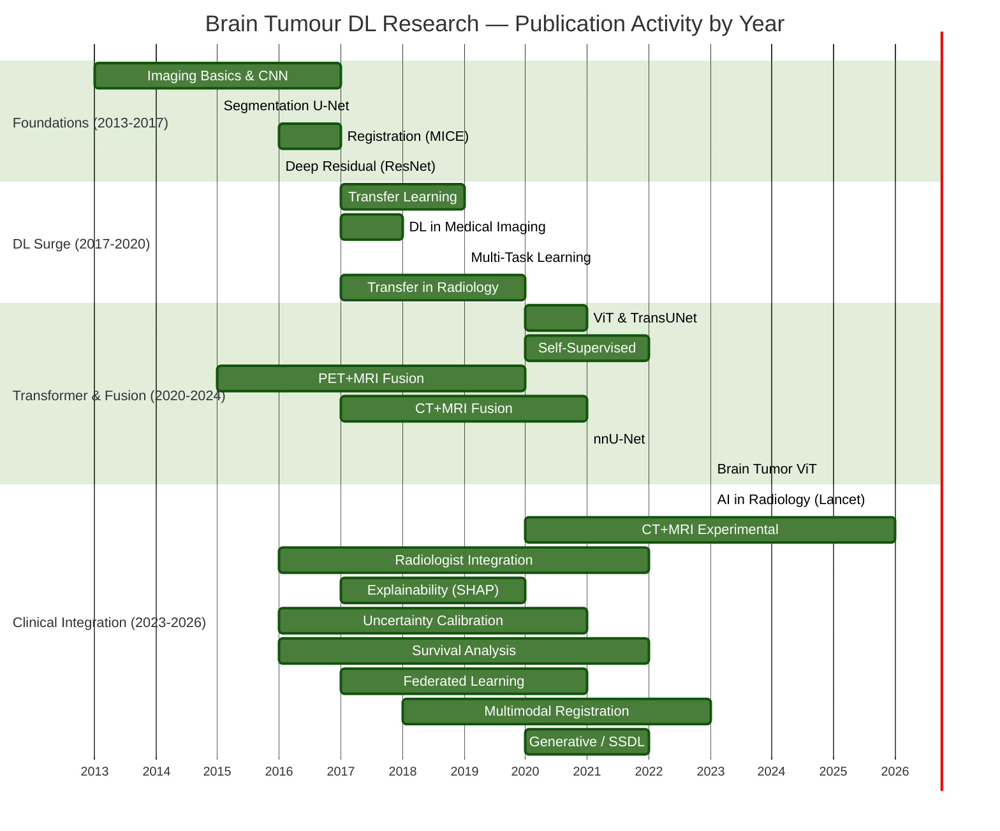

# Brain Tumour DL Research — Publication Trend Map

Generated from 117 papers across 19 research categories (bibtex/*.bib).

## Overall Publication Timeline



## Papers Per Year — Bar Chart (ASCII)

```
2026 █                    1
2025 ██                   2
2024 ███                  3
2023 ██████████          10
2022 ███████████         11
2021 ██████████████████  26  ← PEAK
2020 ███████████████     15
2019 █████████           9
2018 █████████████       13
2017 █████████████████   15
2016 ████████            7
2015 ████                4
2013 █                   1
```

**Peak year:** 2021 (26 papers) — driven by nnU-Net, Swin-Transformer, ViT expansion, and BraTS 2021 challenge.

## Topic Distribution

```
CT+MRI Experimental   ████████      8
CT+MRI Fusion         ████████      8
DL Fundamentals       ██████████   10
Datasets              ███           3
Explainability        ███████       7
Federated             █████         5
Generative            ██████        6
Imaging Basics        ███████       7
Metrics               █████         5
Multimodal Register   ██████        6
PET+MRI Fusion        ██████        6
Progression           ███████       7
Radiologist           █████         5
Registration          ██████        6
Segmentation          █████         5
Self-Supervised       ███████       7
Survival              █████         5
Uncertainty           █████         5
```

## Key Research Waves

```mermaid
timeline
    title Brain Tumour DL — 3 Research Waves

    section Wave 1: Foundations (2013-2017)
        2013-2015 : U-Net, Deep Learning basics, Transfer Learning emerges
        2016-2017 : ResNet, BraTS Challenge launches, RANO criteria, CNN-LSTM, SHAP, MICE review

    section Wave 2: Deep Learning Surge (2018-2021)
        2018-2019 : EfficientNet, DenseNet3D, Multi-Task Learning, PET+MRI fMRI fusion, nnU-Net foundations
        2020-2021 : ViT, TransUNet, MAE, Swin Transformer, nnU-Net published, Brain Tumor ViT, Peak year

    section Wave 3: Clinical & Multimodal (2022-2026)
        2022-2023 : Lancet AI-Radiology review, nnU-Net deep dive, Explainability (Grad-CAM++), Survival DeepHit
        2024-2026 : CT+MRI late fusion (Gong 2025), MRI-CT translation (Chen 2026), Experimental prototypes
```

## Trend: Method Evolution Over Time

```mermaid
timeline
    title ML/DL Method Evolution in Brain Tumour Research

    section 2013-2016: Handcrafted Features
        Pre-2016 : Radiomics (PyRadiomics), MICE fusion, traditional classifiers

    section 2017-2019: CNN Era
        2017-2019 : 3D CNNs, CNN-LSTM, Transfer Learning (ResNet/VGG/ImageNet), Segmentation (U-Net/V-Net)

    section 2020-2022: Transformer Revolution
        2020-2022 : ViT, TransUNet, MAE, nnU-Net, Self-Supervised Pretraining, Diffusion Models

    section 2023-2026: Clinical Integration
        2023-2026 : Explainability, Uncertainty Calibration, Federated Learning, Multimodal (MRI+CT) Fusion, Survival Prediction
```

## Subfield Heatmap (Year × Topic)

```
Topic                  | 2015 | 2016 | 2017 | 2018 | 2019 | 2020 | 2021 | 2022 | 2023 | 2024-26
-----------------------|------|------|------|------|------|------|------|------|------|--------
Imaging Basics         |   ●  |  ●●  |      |      |      |      |      |      |  ●   |
Progression            |      |      |  ●   |  ●   |      |  ●   |  ●   |  ●●  |      |  ●
DL Fundamentals        |      |  ●●  |  ●●  |  ●   |  ●   |  ●   |  ●●  |  ●   |  ●   |
PET+MRI Fusion         |      |      |  ●   |  ●   |  ●   |  ●   |  ●   |      |  ●   |  ●
Segmentation           |  ●   |  ●   |      |      |  ●   |  ●   |  ●   |  ●   |      |  ●
AI Architectures       |      |      |  ●   |      |  ●   |  ●   |  ●●  |  ●   |      |
Registration           |      |  ●   |  ●   |      |      |  ●   |  ●   |  ●   |  ●   |
CT+MRI Fusion          |      |      |  ●   |  ●   |      |  ●   |  ●●  |      |  ●   |
Multimodal Register    |      |      |      |      |  ●   |      |  ●   |  ●   |  ●   |  ●
Self-Supervised        |      |      |      |      |      |  ●   |  ●   |  ●●  |      |  ●
Generative             |      |      |      |      |      |  ●   |  ●   |  ●   |      |  ●
Explainability         |      |      |  ●   |  ●   |      |  ●   |  ●   |      |  ●   |
Uncertainty            |      |      |      |      |      |  ●   |  ●   |      |  ●   |  ●
Survival               |      |  ●   |      |  ●   |      |  ●   |      |  ●   |  ●   |
Federated              |      |      |  ●   |      |      |  ●   |  ●   |  ●   |      |
Datasets               |      |      |      |      |      |      |      |      |  ●   |  ●
Metrics                |      |  ●   |  ●   |      |      |  ●   |  ●   |      |      |  ●
Radiologist            |      |  ●   |  ●   |      |  ●   |      |  ●   |  ●   |      |  ●
CT+MRI Experimental    |      |      |      |      |      |  ●   |      |  ●   |  ●   |  ●●
```

> ●● = 3+ papers that year · ● = 1-2 papers
